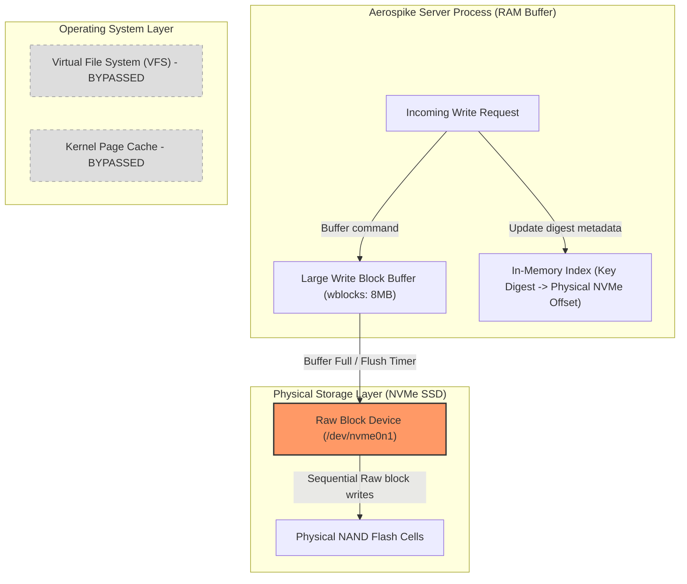
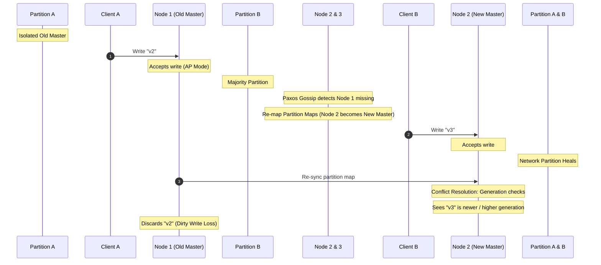

# RFC: Aerospike as a Hybrid Flash Persistence Engine

**Title:** `[RFC][Storage] Evaluating Aerospike Community Edition for Substrate Registry`

Hi everyone,

I've put together a deep dive on **Aerospike Community Edition** to see if it can act as a strongly consistent (RPO = 0) data store for Substrate's persistent registry. 

Because Aerospike bypasses the OS filesystem (VFS) and writes directly to raw NVMe block storage, I wanted to see if we could use it to handle our strict sub-10ms latency budget and 1 Billion registered actors.

Here is the detailed breakdown of where it fits, where it falls on its face, and why it's unfortunately a no-go for our consistency goals.

---

## TL;DR / Executive Summary
* **The Consensus:** **Aerospike Open Source (Community Edition) is a no-go for Substrate's persistent registry.** 
* **The Blocker:** While Aerospike's hybrid memory engine is incredibly cost-effective, **Strong Consistency (SC) is strictly an Enterprise-only commercial feature**. The open-source Community Edition (AGPL-3.0) only supports **AP mode (eventually consistent)**. 
* **The Risk:** During network partitions, Aerospike CE will suffer from split-brain writes, dirty reads, and silent write loss, failing our strict zero-data-loss (RPO = 0) SLA.

---

## Deep Dive: Aerospike's HMA & Block-Storage Engine

Aerospike uses a **Hybrid Memory Architecture (HMA)**: it stores the primary indexes in RAM and offloads record payloads directly to NVMe SSDs.

### 1. Bypassing the VFS: Raw Block sequential Buffering
Instead of writing records through a traditional filesystem layer (which introduces OS buffer overhead and sync locks), Aerospike interacts directly with raw NVMe block storage.

#### How it works:
* **Large Write Blocks (wblocks):** Writes are accumulated in memory buffers and flushed to NVMe block partitions in large **8MB write blocks (wblocks)**. This aligns perfectly with SSD page mapping, keeping the **Write Amplification Factor (WAF)** near 1.0 and preventing write-wear latency spikes.
* **Predictable 1-I/O Reads:** The index is in memory, mapping the key digest directly to its SSD physical offset. Finding a record is a local $O(1)$ CPU lookup, meaning **any read query takes exactly 1 physical SSD block read I/O**, guaranteeing highly consistent sub-millisecond $p99$ tail latencies.

---

### 2. Memory & Cost Footprint at Scale (Empirical Calculations)
Let's run the math for **1 Billion registered actors** based on the fields in `ateapi.proto` (UUID, templates, pod IPs, GCS URIs):
* **Raw JSON payload:** $\approx 400\text{ Bytes}$.
* **Key name:** `"actor:<actor-id>"` $\to$ $\approx 48\text{ Bytes}$.

Here is how Aerospike's RAM footprint compares to Valkey:

* **Valkey/Redis (All in RAM):** 
  Valkey's extensive metadata wrapping (dict entry pointers, robj headers, `jemalloc` page rounding) inflates our 400B payload to a physical footprint of **`~640 Bytes per actor`**.
  * **Valkey RAM required:** **`~640 GB`** (requires a **16-node HA cluster** costing **`~$16,000 / month`**).
* **Aerospike HMA (Index in RAM, Data on SSD):** 
  Aerospike stores only a fixed-size primary index entry of exactly **`64 Bytes per record`** in RAM, offloading the 400B JSON payload entirely to SSD.
  * **Aerospike RAM required:** **`~64 GB of RAM`** + **`~400 GB of SSD`** (requires only **2 database nodes** costing **`~$300 / month`**). This is a **90% memory footprint reduction**!

---

### 3. The Gotchas: Consistency Limits & Defrag Storms
Despite the massive cost savings, Aerospike CE has two major operational challenges that make it a no-go for us:

#### A. The AP Mode Split-Brain Hazard
Paxos is only used for cluster membership maps; it is **never** used on the transaction hot path.
Because **Strong Consistency (SC) mode is an Enterprise-only commercial feature**, the open-source Community Edition (AGPL-3.0) operates strictly in **AP mode (eventually consistent)**.

During network splits, the isolated master will continue accepting writes. Once healed, Aerospike CE resolves conflicts using generation metadata, **silently discarding the isolated writes and resulting in permanent data loss**.

#### B. The Defragmentation "Defrag Storm"
As records are updated/deleted, background defragmentation scans raw blocks, consolidates live records, and frees space, creating background Write Amplification (minimum 2X).
Under continuous high-QPS writes (50k+ QPS), if the defragmentation queue (`defrag_q`) backs up, the defrag thread saturates NVMe I/O queues, causing **unpredictable tail-latency spikes ($p99 > 50\text{ms}$)**.

#### C. Real-World Case Studies
* **Adobe:** Had to meticulously tune `defrag-lwm-pct` and `defrag-sleep` to prevent defragmentation threads from starving local NVMe controllers under write-heavy workloads.
* **Abnormal Security:** Bypassed in-RAM indexing completely for large datasets by pivoting to **RocksDB** on raw SSDs, as keeping billions of keys in memory is still operationally expensive even under HMA.
