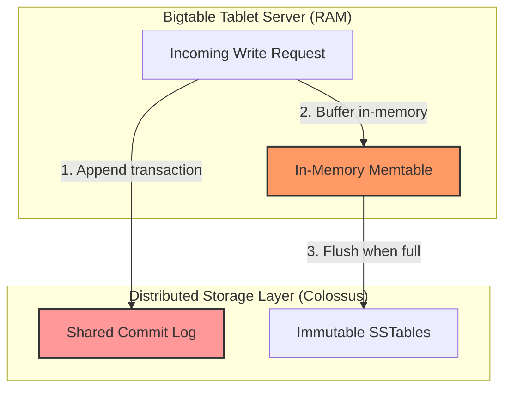
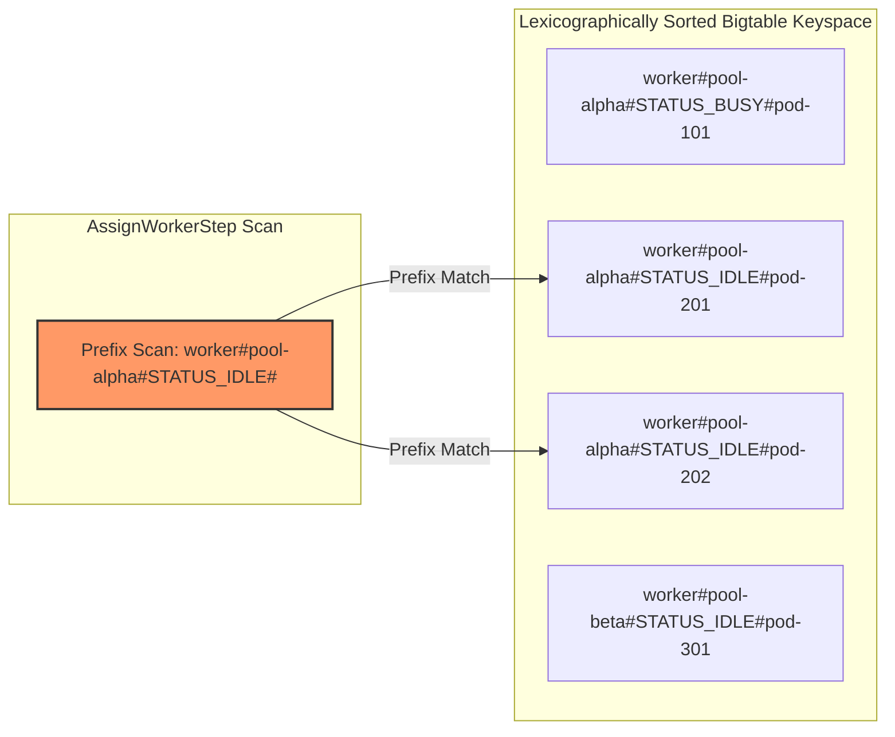
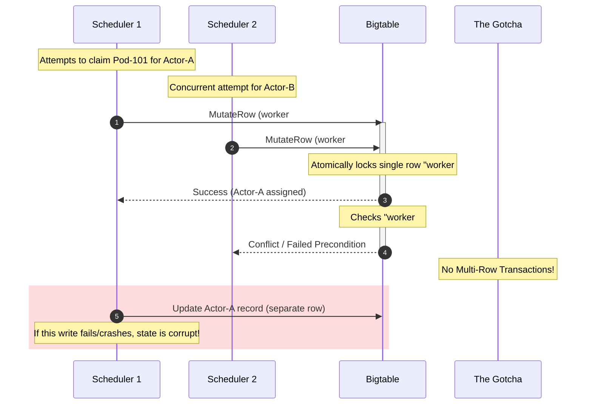
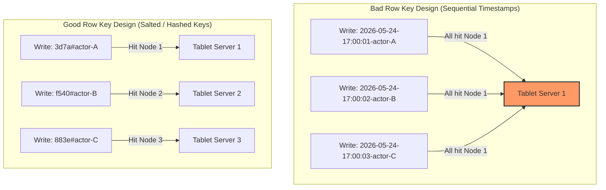

# RFC: Google Cloud Bigtable as a Control Plane Registry

**Title:** `[RFC][Storage] Evaluating Google Cloud Bigtable for Substrate Persistence Layer`

Hi team,

Here is my deep dive into **Google Cloud Bigtable** as a candidate for our Control Plane Persistence Layer. 

Bigtable is a cloud-native, highly scalable wide-column NoSQL database. Because it decouples compute (Bigtable nodes) from storage (Google's Colossus distributed file system), it offers massive write throughput and extremely low write latencies.

Here is the lowdown on how Bigtable's Log-Structured Merge-tree (LSM) architecture behaves under our NFRs, how we can work around its transactional limitations, and the operational tradeoffs we need to consider.

---

## TL;DR / Executive Summary
* **The Consensus:** **Cloud Bigtable is a strong contender for our Durability Layer (Registry), but it cannot act as a lock manager or session coordinator.**
* **The Highlights:** Writes are blazingly fast ($2\text{ms} - 5\text{ms}$) and scale linearly. It easily handles a dataset of 1 Billion actors on SSD-backed Colossus storage at an extremely low storage cost.
* **The Showstoppers:** 
  1. **No Multi-Row ACID:** Bigtable only guarantees atomicity *within a single row*. Cross-row transactions (like atomically assigning a worker to a separate actor record) are impossible without an external coordinator.
  2. **No Native Lease Deletions (TTL):** Bigtable's cell TTL garbage collection is asynchronous and eventually consistent, meaning we cannot rely on it for strict lease expiration.
  3. **No $O(1)$ Random Pops:** To pick an idle worker, we have to use range scans on lexicographically ordered row keys instead of simple `SPOP` operations.

---

## Deep Dive: Bigtable's LSM Storage & Data Flow

Unlike Aerospike which writes directly to local NVMe blocks, Bigtable writes to a distributed file system (**Colossus**) using a Log-Structured Merge-tree (LSM) architecture.

### 1. The Write Path: Memtable & Commit Log flushes
Bigtable handles high write QPS (50k+) by buffering updates in memory before writing immutable files to disk.

#### Execution Path & Performance Mechanics:
1. **Commit Log Append:** When a write arrives at a Tablet Server, it is immediately appended to a shared sequential commit log on Colossus to guarantee durability.
2. **Memtable Buffering:** The update is written to an in-memory sorted buffer called the **Memtable**. Once written to the Memtable, the database returns success to the client ($2\text{ms} - 5\text{ms}$).
3. **SSTable Flushing:** When the Memtable fills up, it is flushed to Colossus as an immutable **SSTable (Sorted String Table)**.
4. **LSM Compaction (The Bottleneck):** Over time, hundreds of SSTables accumulate. Bigtable runs a background compaction process to merge SSTables and purge deleted cells. Under heavy concurrent writes (50k+ QPS), this compaction triggers significant write amplification, leading to **compaction storms** and temporary tail-latency spikes ($p99 > 15\text{ms}$).

---

### 2. Scheduling & Selection: Bypassing $O(1)$ Pops with Range Scans
Bigtable does not support sets or random pops (`SPOP`). To select an idle worker, we must design a lexicographically sorted row key schema.

#### How we implement scheduling:
* **Lexicographical Sorting:** Bigtable rows are kept sorted alphabetically by row key.
* **Row Key Design:** We index worker status directly inside the row key:
  `worker:<pool_name>#<status>#<pod_name>`
* **Prefix Scan:** To find an idle worker in `pool-alpha`, the scheduler issues a **Prefix Range Scan** for `worker:pool-alpha#STATUS_IDLE#`.
* **Complexity:** This is technically an $O(N)$ scan over the idle subset. However, because the number of physical worker pods is small ($\le 5,000$), a scan of a few dozen rows takes less than **$1\text{ms}$**, making it a viable alternative to Valkey's `SPOP`.

---

### 3. The Transaction & Lease Locking Barrier
Substrate requires distributed locks to prevent multiple schedulers from claiming the same worker or actor. Here is why Bigtable struggles as a lock manager.

#### The Crucial Limitations:
* **Single-Row Atomicity Only:** Bigtable **does not support multi-row transactions**. If we need to mark a worker as busy (Row 1) and assign the worker's IP to an actor (Row 2), we cannot do this atomically. If the application crashes mid-way, we are left in an inconsistent state.
* **Asynchronous TTLs:** Bigtable allows cell-level garbage collection (TTLs). However, **deletion is eventually consistent and handled asynchronously in the background** (often taking hours or days to physically remove deleted cells). We cannot rely on this for our strict scheduling leases; the application would have to manually filter expired timestamps.

---

### 4. Memory & Cost Footprint at Scale
Let's evaluate the TCO of storing **1 Billion Actors** (400 Bytes JSON payload per actor) on Cloud Bigtable:

* **RAM Footprint:** **`0 GB`**. Unlike Valkey (640 GB RAM) and Aerospike (64 GB RAM), Bigtable indexes are kept on SSD block indexes, buffered dynamically in memory.
* **SSD Storage Footprint:** **`~400 GB of SSD`**.
* **Operational Cost:**
  * Bigtable storage is cheap ($\approx \$0.026$ per GB/month $\to$ **`$10 / month`**).
  * **The Catch:** Bigtable requires provisioning nodes for throughput. A minimum production setup (1-node SSD cluster in GCP) costs **`~$650 / month`**.

---

### 5. Pushing Write Performance & Real-World Case Studies

When scaling to millions of QPS, Bigtable's performance is bounded by node provisioning and compaction efficiency:

#### A. Spotify: Autoscaling Millions of Write QPS
* **Read the Case Study:** [Bigtable Autoscaler: Saving Money and Time Using Managed Storage (Spotify Engineering)](https://atspotify.com/2018/12/18/bigtable-autoscaler-saving-money-and-time-using-managed-storage/)
* **The Challenge:** Spotify uses Cloud Bigtable to store music personalization profiles, playlist edits, and real-time listener behavior. Under sudden surges in traffic, under-provisioned clusters suffered from **SSTable merge/compaction storms**, backing up Colossus I/O queues and spiking write latencies from $<5\text{ms}$ to $>50\text{ms}$.
* **The Optimization:** They built a custom **Bigtable Autoscaler** that monitors Tablet Server CPU utilization and storage limits. It dynamically adds nodes to parallelize the SSTable compaction queue during write surges and scales back down during quiet hours, keeping $p99$ writes under $10\text{ms}$.

#### B. Google Cloud: Single-Row Throughput Tuning
* **Read the Analysis:** [Improving Bigtable Single-Row Read/Write Throughput](https://cloud.google.com/blog/products/databases/improving-cloud-bigtable-single-row-read-throughput)
* **The Performance Limit:** Under optimal schemas, Bigtable scales **100% linearly**. A single SSD-backed node easily delivers **10,000 write QPS** at sub-10ms latencies. To scale Substrate to our 50k QPS target, we simply provision 5 nodes; Bigtable automatically splits and redistributes our tablets.

---

### 6. The Row Key Hotspotting Trap

Because Bigtable maintains rows sorted alphabetically by row key, a poor key design will completely destroy write throughput by pinning a single node to 100% CPU while other nodes sit idle.

#### The Mechanics:
* **The Sequential Trap:** If we design row keys starting with sequential data (like a timestamp: `timestamp#actor-id` to log wakeup events), **100% of concurrent writes will hit the exact same tablet server range**. This creates a "bright band" (hotspot) on our Key Visualizer, throttling write QPS.
* **The Salted Key Mitigation:** We must prefix our keys with a hash of the actor ID (e.g., `md5(actor-id)[:4]#actor-id`). This scatters writes uniformly across the entire cluster key range, allowing us to easily parallelize and scale past 50k+ QPS without hitting a latency wall.

***

Let me know what you think! I will document **Section 4: Amazon DynamoDB** next.
