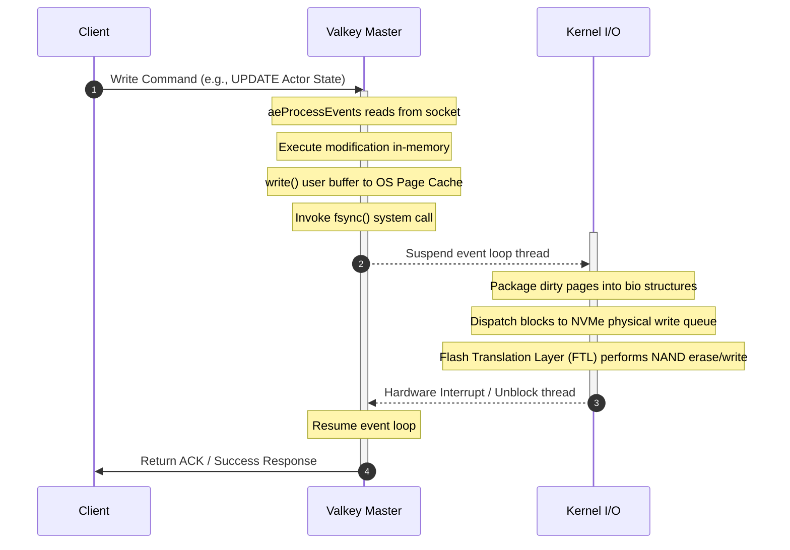
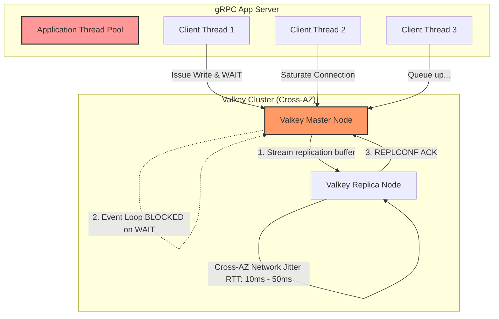
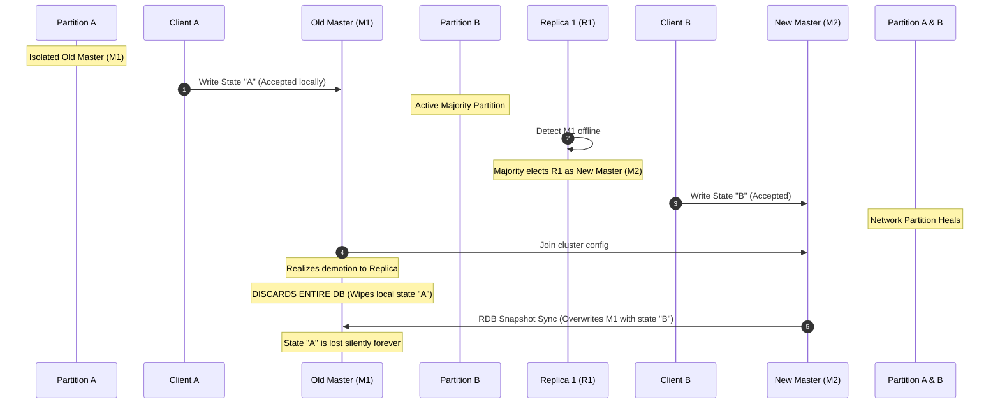
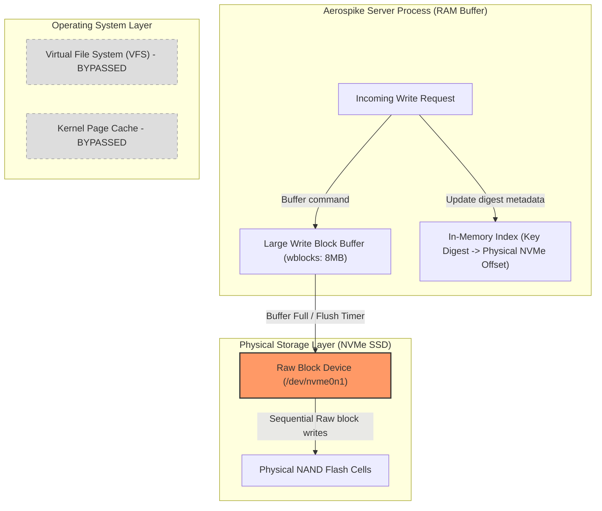

# RFC: Control Plane Persistence Layer — Valkey vs. Aerospike Deep Dive

**Title:** `[RFC][Architecture] Valkey/Redis vs. Aerospike: Scaling the Control Plane Persistence Layer`

Hi everyone,

I’ve been digging into the data usage patterns and scaling bottlenecks for Substrate’s **Control Plane Persistence Layer**. 

As a quick refresher, our target North Star NFRs are pretty intense:
* **1 Billion registered actors**
* **1,000+ concurrent wakeups/second**
* **Strict sub-100ms workload activation (wakeup) latency**
* **Zero data loss (RPO = 0) for critical state transitions** (like worker leases and actor checkpoints).

Currently, we are using Valkey/Redis. I wanted to run the math and trace the low-level system calls to see if it can actually handle this scale when forced into a strongly consistent posture. I also evaluated **Aerospike Community Edition** as a potential direct block-storage alternative.

Here is the detailed breakdown of where things stand, what works, and where they completely fall on their faces.

---

## TL;DR / Executive Summary
* **The Consensus:** **Neither Valkey nor Aerospike Community Edition can act as a unified, strongly consistent (RPO = 0) registry at our target scale.** Forcing either into a strict durability posture kills the performance engine, creates devastating latency walls, or triggers silent data loss during partitions.
* **The Proposed Path:** We must adopt a **decoupled hybrid architecture**:
  1. **Speed Layer (Valkey Cache):** Run Valkey **100% in-memory (`appendfsync no`, async replication)** strictly for ephemeral active session routing and the $O(1)$ `idle_workers` scheduling queue. At 100k active actors, this requires **less than 64 MB of RAM** (costing $\approx \$5/\text{month}$).
  2. **Durability Layer (Persistent Registry):** Offload the cold registry and Golden Snapshots to a distributed, consensus-backed store (like **Cloud Spanner** or a highly indexed **Cloud Bigtable** schema) that natively handles SSD writes and Paxos/Raft quorums. Stores 1 Billion actors (100 GB raw) for **$\approx \$25/\text{month}$**, dropping database TCO by **99.8%**.

---

## Deep Dive 1: Valkey/Redis Under the Gun (Strong Durability)

Forcing Valkey/Redis to guarantee RPO = 0 requires setting `appendfsync always` and using synchronous replication (`WAIT`). Here is why this strategy immediately runs into a brick wall.

### 1. The Fsync Always Bottleneck
Because Valkey uses a single-threaded event loop (`ae`), calling `fsync` synchronously serializes all client operations.

#### What's happening under the hood:
* **Blocked Event Loop:** Unlike standard async writes that return once copied to the kernel page cache, `fsync()` forces the event loop to block. The OS suspends the Valkey thread while the block layer dispatches I/O requests to the physical NVMe controller.
* **Write Amplification (WAF) Spike:** The NVMe Flash Translation Layer (FTL) controller dispatches NAND flash erase-and-write cycles, triggering write amplification latency spikes.
* **The Performance Cliff:** This stalls the event loop cycle time from $<100\mu\text{s}$ to $1\text{ms} - 3\text{ms}$. This caps single-shard throughput at a hard ceiling of **300 to 1,000 write QPS** and triggers an exponential tail-latency queueing wall ($p99.9 > 100\text{ms}$), blowing past our wakeup budget.

### 2. Replication & The `WAIT` Command (Cross-AZ Sync)
To protect against node loss, we have to use `WAIT <num_replicas> <timeout>`. 

#### The Catch:
* **Cross-AZ Network Floor:** Multi-AZ cloud round-trips (RTT) add a baseline network floor of $1.5\text{ms} - 3\text{ms}$. Any packet jitter or hypervisor CPU steal immediately stalls the master event loop during `WAIT`.
* **Thread Starvation:** When the database blocks on `WAIT`, our `ateapi` server’s gRPC threads block waiting for Valkey. Saturated connection pools trigger a cascading thread exhaustion failure across the control plane.
* **Ambiguity:** If the replica delays or pings out, `WAIT` times out and returns a success code lower than requested. We are left with an ambiguous consistency state.

### 3. The Consensus Deficit
Redis Cluster/Sentinel uses asynchronous gossip and majority voting for failover, **lacking a formal Paxos/Raft state-machine replication**.

#### The Failure Scenario:
If a network partition splits the cluster, the isolated master (`M1`) keeps accepting writes from Client `A`, while the majority partition elects a replica (`R1`) to be the new master (`M2`). 
When the partition heals, **the old master `M1` is demoted and forced to completely discard its database to sync with `M2`**. All writes processed on `M1` during the partition are silently and irreversibly wiped.

---

## Deep Dive 2: Aerospike Hybrid Flash (Contender or No-Go?)

Aerospike’s **Hybrid Memory Architecture (HMA)** bypasses the OS filesystem entirely, keeping the index in RAM and record payloads on raw SSD block devices.

### 1. Bypassing the VFS: Raw Block Sequential Buffering
Aerospike bypasses the kernel page cache and VFS layer, avoiding locking contention and context switches.

#### How it works:
* **Large Write Blocks (wblocks):** Records are buffered in RAM and flushed to NVMe SSDs in large **8MB blocks (wblocks)** via direct DMA, matching SSD page allocations and keeping Write Amplification (WAF) near 1.0.
* **The Read Path:** Because the index is fully in memory ($O(1)$ hashtable mapping key digests to SSD offsets), **any read request takes exactly 1 NVMe physical I/O**, maintaining predictable sub-millisecond $p99$ tail latencies.

### 2. The Cost/Memory Footprint (Empirical Calculation)
Let's look at the exact protobuf fields from `ateapi.proto` for our `Actor` message (UUID, template refs, enums, pod IPs, GCS snapshot URIs). 
* Raw JSON payload: **`~400 Bytes`**.
* Key name: `"actor:<actor-id>"` $\to$ **`~48 Bytes`**.

Here is the RAM comparison for **1 Billion registered actors**:

* **Valkey/Redis (All in RAM):** 
  Valkey has massive metadata wrapping. Dict entries, robj headers, and `jemalloc` page padding expand our 400B payload to a physical footprint of **`~640 Bytes per actor`** (reduced to $\approx 550\text{B}$ in Valkey 8).
  * **Valkey RAM footprint:** **`~640 GB of RAM`** (requires a **16-node HA cluster** costing **`~$16,000 / month`**).
* **Aerospike HMA (Index in RAM, Data on SSD):** 
  Aerospike stores only a fixed primary index entry of exactly **`64 Bytes per record`** in RAM, offloading the 400B JSON payload entirely to the SSD.
  * **Aerospike RAM footprint:** **`~64 GB of RAM`** + **`~400 GB of SSD storage`** (requires only **2 database nodes** costing **`~$300 / month`**).

### 3. The Big Catch: Consistency Limits & Defrag Storms
Despite the 90% memory footprint reduction, Aerospike CE has two major limitations:
* **SC Mode is Enterprise-Only:** **Strong Consistency (SC) mode is strictly gated behind an expensive Enterprise commercial license**. The open-source Community Edition (AGPL-3.0) is strictly **AP (eventually consistent)** and suffers from the same split-brain/LWW override write loss as eventually consistent Valkey.
* **The Defrag Storm:** As updates and deletes occur, blocks become fragmented. Aerospike dispatches background defragmentation. Under continuous high-QPS writes (50k+ QPS), if the defrag queue (`defrag_q`) backs up, it begins competing with raw writes for NVMe queue depth. This triggers severe write stalls and **massive tail-latency spikes ($p99 > 50\text{ms}$)**, violating our low-latency budget.

---

## Next Steps
I believe this confirms that we must decouple our storage layers. 

Let me know what you think of this breakdown! I'm planning to document **Section 3: Google Cloud Bigtable** next to see how its wide-column design and local lock-free architecture stack up for our durability layer.
