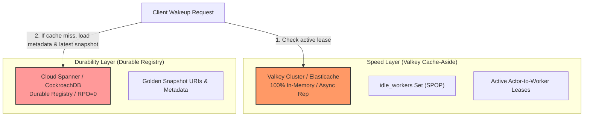
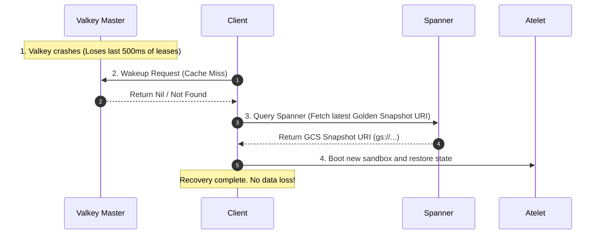
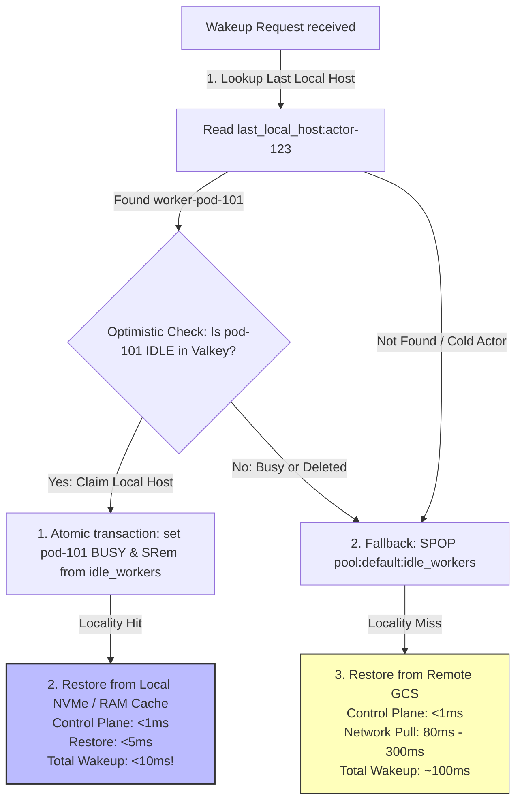

# RFC: Substrate Hybrid Control Plane Design & Staff Trade-Off Review

**Title:** `[RFC][Architecture] The Speed/Durability Split: Staff Design Review & Risk Analysis`

Hey team,

Let's get real. We’ve spent the last few days tearing down database architectures. The math is clear: trying to build a unified persistence layer that is both ultra-low latency ($<10\text{ms}$) and 100% durable (RPO = 0) at a scale of 1 Billion actors is a fool's errand. 

If we try to do everything in Valkey RAM, our cloud bill will be $\$16,000/\text{month}$ strictly for idle memory. If we try to do everything in Spanner or Bigtable, our wakeup latency budget gets blown by distributed network handshakes and 2PC protocols.

Below is our proposed **Speed/Durability Hybrid Architecture**, followed by a highly candid, staff-level grilling of the trade-offs, eventual consistency edge cases, and an honest analysis of our absolute worst-case data loss scenarios.

---

## 1. The Selected Stack: Speed/Durability Split

We propose dividing the control plane into two decoupled tiers using standard, off-the-shelf hosted services to keep the engineering and maintenance burden near zero:



1. **The Speed Layer (Valkey Cluster):** 
   * **Configuration:** Hosted Valkey (MemoryStore or ElastiCache) running in **100% in-memory mode (`appendfsync no`, async replication)**.
   * **Role:** Manages the active $O(1)$ scheduling queues (`idle_workers` set) and active actor-to-worker pod lease mappings.
2. **The Durability Layer (Cloud Spanner / CockroachDB):**
   * **Configuration:** Fully managed relational distributed SQL.
   * **Role:** Acts as the single-source-of-truth registry, storing actor account metadata, template configurations, and the physical URIs of golden snapshots (on GCS/S3).
3. **The Reconciliation Layer (WorkerPoolSyncer):**
   * **Configuration:** A background Go goroutine running inside `ateapi` matching K8s pod informer states against Valkey indexes.

---

## 2. The Grilling: Grilling Our Design Trade-Offs

Here is the raw, uncensored QA review where we challenge our own architectural assumptions.

### Q1: "If we run Valkey with async replication, we WILL lose writes during a crash. Are we seriously okay with losing lease writes?"
**Yes, and here is why:** 
The lease mapping (which actor is running on which worker pod) is **derived, ephemeral state**. It is not primary master data. 
If a Valkey node crashes and we lose the last 500ms of lease writes:
* **The Recovery Path:** The client's next request will trigger a cache miss in Valkey. The control plane will simply query Spanner, see the actor is technically "suspended" or "resuming," claim a new worker, and restore the actor from the last golden snapshot URI.


* **The Trade-off:** The user experiences a slightly longer wake-up time ($100\text{ms} \to 500\text{ms}$) for that single request because we had to perform a fresh restore. But **zero permanent data is lost**. For an agent system, this is an exceptional trade-off.

---

### Q2: "If Valkey is eventually consistent, what happens to leaked resources? Won't we orphan worker pods?"
**Yes, but our background syncer heals this completely off the critical path:**
* **The Scenario:** A scheduler claims a worker pod and clears it from `idle_workers`. The app server crashes before updating the worker metadata. The worker pod is now "orphaned" (idle in the database, but missing from the `idle_workers` set).
* **The Healing Loop:** Our background `WorkerPoolSyncer` runs every 1 minute. It performs a scan of our active worker records (which is small: $W \le 5,000$ pods) and calls `EnsureWorkerIdle()`:
  * If a worker pod is found to have `ActorId == ""` (idle) but is missing from the Valkey `idle_workers` set, it **adds it back**.
* **The Trade-off:** For a maximum of 60 seconds, our available worker pool is temporarily reduced by 1 pod. Under our high-throughput workload, a transient 0.02% capacity drop has **zero impact** on overall system performance and is infinitely better than adding blocking database locks to the hot path.

---

### Q3: "Why Cloud Spanner? Isn't the engineering burden of a heavy relational DB too high compared to RocksDB?"
**No, managed NewSQL actually reduces our engineering burden to near zero:**
* **The RocksDB Trap:** Running RocksDB inside the `ateapi` process is incredibly fast ($<100\mu\text{s}$). But RocksDB is a local, single-node database. If our application container crashes, our data is locked on that host's local SSD. To make it resilient, we would have to write our own distributed consensus layer (like Raft in Go) around RocksDB. That is a **months-long engineering task** that is prone to subtle concurrency bugs.
* **The Spanner Solution:** By using Cloud Spanner or a managed CockroachDB cluster, we get a fully hosted, serverless, consensus-backed database that handles sharding, backups, and replication out of the box. We don't have to write a single line of replication code.

---

### Q4: "During wakeup, we write asynchronously to Spanner. If Spanner is eventually consistent, does this database lag introduce race conditions or double-claiming?"
**No, eventual consistency here is 100% safe and logically correct:**
To meet our sub-10ms wakeup target, we cannot wait for Spanner's synchronous 2PC Paxos write. When the wakeup succeeds, we immediately return success to the client, and flush the `Actors` status update (`status = STATUS_RUNNING`) asynchronously to Spanner in the background.
Let's trace the safety of this database lag:
* **Routing & Concurrency (No Impact):** Valkey *is* synchronously updated during wakeup. Since incoming API routing and duplicate wakeup requests always check Valkey's `active_actor_lease` first, routing works flawlessly in real-time despite Spanner lagging.
* **Crash Recovery (Self-Healing):** If both the worker pod and Valkey crash while the Spanner write is lagging, Spanner still shows `status = STATUS_SUSPENDED` pointing to the old GCS snapshot. During the next wakeup attempt, the scheduler will fall back to GCS and restore from this snapshot. Because the running memory state was wiped by the crash anyway, rolling back to the last durably saved snapshot in Spanner is the **physically correct recovery state**. The database lag matches reality perfectly!

---

### Q5: "Why Cloud Spanner (NewSQL) instead of a managed NoSQL (like Bigtable or DynamoDB) for our Durability Layer?"
**Because the Durability Layer is highly relational and requires rich operational querying, which NoSQL is terribly suited for:**
While NoSQL databases (Bigtable/DynamoDB) offer fast single-key writes, they fail completely when forced to manage complex, relational metadata registries:
* **Relational Integrity:** Our control plane registry is highly structured (Actors belong to Tenants, derive from ActorTemplates, and reside on Workers in specific WorkerPools). Storing this in a relational database gives us **declarative schemas, foreign-key constraints, and cascade-deletes**, preventing orphaned data or state drift.
* **Rich Operational Queries:** For operations and analytics, we frequently need to run complex queries off the critical path (e.g., *"Find all suspended actors for Tenant X that have not been woken up in 30 days so we can archive their snapshots"*). Running this on Spanner is a simple SQL query with secondary indexes. On NoSQL, this requires expensive, full keyspace scans ($O(N)$) or maintaining a separate indexing pipeline.
* **The Latency Trade-off is Neutralized:** Yes, Spanner's writes are slower ($10\text{ms} - 15\text{ms}$). But since we **decoupled the write** during wakeup (making the `STATUS_RUNNING` Spanner update 100% asynchronous), **Spanner's latency is completely removed from the critical path**. We get the power of strict SQL consensus without paying the hot-path speed tax.

---

### Q6: "What if a customer cannot or does not want to run on GCP Spanner? Does this architecture lock them in?"
**No, this speed/durability split actually makes database portability incredibly easy:**
Because we completely avoided database-level distributed transactions and custom locking APIs, our `store.Interface` boundary is extremely simple and clean:
* **PostgreSQL Dialect Compatibility:** Cloud Spanner natively supports the **PostgreSQL Dialect**. This means we can write standard PostgreSQL schemas (DDL) and SQL queries that compile and run unmodified on both a local/on-prem **PostgreSQL** database (or **CockroachDB** for multi-node scaling) and a production **Cloud Spanner** cluster on GCP!
* **Trivial Backend Portability:** Writing a `store/atepostgres` package that implements our Go `store.Interface` using standard Go `database/sql` and standard PostgreSQL is a very small, straightforward task (under 300 lines of clean SQL). 

Non-GCP, open-source, or on-prem customers can run standard **PostgreSQL** or **CockroachDB** (fully wire-compatible), while GCP enterprise customers can run **Cloud Spanner**, with zero changes to the core Substrate control plane code!

---

## 3. The Worst-Case Scenario: "Micro-Amnesia"

What is the absolute worst-case failure mode of this hybrid design, and what does it actually mean for a user chatting with an AI agent?

### The Worst-Case Failure Chain:
1. An active agent (Actor) is running in a worker pod sandbox.
2. The user sends a prompt, and the agent updates its internal, transient working memory (e.g., learning a new user preference or processing a conversational turn).
3. **The Crash:** The physical worker pod hosting the active agent sandbox suffers a sudden hardware failure, OR the Valkey master crashes before the actor goes idle, which is the **only** trigger that initiates a durable snapshot write to GCS and updates the Spanner metadata URI.

```mermaid
timeline
    title The Micro-Amnesia Worst-Case Scenario (Suspend-on-Idle)
    section 17:00:00 (Idle)
        Durable Checkpoint : State A saved to GCS; URI stored in Spanner
    section 17:02:00 (Active)
        User Prompt : Wakeup; Agent processes chat in active host RAM (State B)
    section 17:03:00 (Failure)
        Host Pod Crash : Physical worker node dies; Active RAM (State B) is lost
    section 17:03:05 (Recovery)
        Rollback : System fetches State A GCS URI from Spanner
        "Amnesia" : Sandbox boots from State A; Agent forgets State B chat turns
```

### What this means for the user:
* **The "Micro-Amnesia" Impact:** The agent is restored successfully from the last golden snapshot stored on GCS (State A). However, it **forgets the active conversation turns** processed since the last time it went idle (State B).
* **The User Experience:** The user experiences a brief "connection reset" or minor conversational rollback and has to re-input their last prompt. 
* **Is this acceptable?** **Absolutely.** In the context of LLM and AI Agent interactions, a transient conversational reset is a minor operational bump. It is **not a catastrophic failure** (no account records were corrupted, no persistent databases were compromised). 

Accepting "Micro-Amnesia" during physical node crashes allows us to completely avoid the blocking database latency taxes that would otherwise slow down 100% of our daily wake-up requests.

---

## 4. Data Schemas & Topology (What gets stored where?)

### A. The Speed Layer: Valkey / Redis Cluster (In-Memory)
Stores only volatile, high-frequency activation leases and scheduling queues:
1. **`pool:<namespace>:<pool_name>:idle_workers` (Set):**
   * *Payload:* String pod names (e.g., `"worker-pod-abc-123"`).
   * *Role:* $O(1)$ atomic `SPOP` scheduling queue.
2. **`active_actor_lease:<actor_id>` (String Key-Value):**
   * *Payload:* `{ "workerPodName": "worker-pod-abc-123", "workerPodIp": "10.120.15.24", "leaseExpiration": 1716595850 }`
   * *Role:* Real-time routing target. Read by control plane to bypass persistent lookups.
3. **`worker_state:<pod_name>` (String Key-Value):**
   * *Payload:* `{ "actorId": "actor-123", "status": "BUSY" }`
   * *Role:* Real-time capacity tracking of worker nodes.

### B. The Durability Layer: Cloud Spanner / NewSQL (SSD-Backed)
Stores the authoritative, durable, and cold relational registry:
1. **`Actors` Table:**
   ```sql
   CREATE TABLE Actors (
     actor_id STRING(64) NOT NULL,
     actor_template_namespace STRING(64) NOT NULL,
     actor_template_name STRING(64) NOT NULL,
     status INT64 NOT NULL,           -- STATUS_SUSPENDED, STATUS_RUNNING, etc.
     last_snapshot_uri STRING(256),   -- points to gs://bucket/...
     version INT64 NOT NULL,          -- optimistic locking check
     created_at TIMESTAMP NOT NULL,
   ) PRIMARY KEY (actor_id);
   ```
2. **`Workers` Table:**
   ```sql
   CREATE TABLE Workers (
     worker_pod_name STRING(64) NOT NULL,
     worker_pool_name STRING(64) NOT NULL,
     worker_namespace STRING(64) NOT NULL,
     ip STRING(45) NOT NULL,
     status INT64 NOT NULL,           -- idle vs active
     last_sync_time TIMESTAMP NOT NULL,
   ) PRIMARY KEY (worker_pod_name);
   ```

---

## 5. Event-Driven Write Flows (What goes where?)

```mermaid
sequenceDiagram
    autonumber
    Note over Client: Actor Wakeup Request (Resume)
    Client->>Valkey: 1. Check Active Lease (active_actor_lease:actor-123)
    alt Lease Hit (Residing on active pod)
        Valkey-->>Client: Return Worker IP (10.120.15.24)
        Client->>Worker: Route Traffic Directly
    else Lease Miss (Actor is suspended)
        Valkey-->>Client: Return Nil
        Client->>Spanner: 2. Read Registry (Fetch GCS Snapshot URI)
        Spanner-->>Client: Return GCS Snapshot URI
        Client->>Valkey: 3. Claim Worker (SPOP pool:default:idle_workers)
        Valkey-->>Client: Return pod-abc-123
        Client->>Valkey: 4. Write Lease & Mark pod-abc-123 as BUSY
        Client->>Worker: 5. Call Atelet.Restore(gs://snapshot-uri)
        Note over Worker: Pull snapshot from GCS; Restore Memory State
        Client->>Spanner: 6. Update Registry (Asynchronously set status=STATUS_RUNNING)
    end
```

### A. Actor Creation (Cold Path)
* **Write Target:** **Cloud Spanner only.**
* **Flow:** We write a new row to the Spanner `Actors` table (`status = STATUS_SUSPENDED`, `last_snapshot_uri = GoldenSnapshotURI`).
* **Why:** Bypasses Valkey entirely to avoid polluting RAM with cold/unused actors.

### B. Actor Wakeup / Resume (Hot Path)
* **Write Target:** **Valkey (Synchronously), Spanner (Asynchronously).**
* **Flow:** 
  1. Read Spanner `last_snapshot_uri` to fetch the GCS checkpoint location.
  2. Perform `SPOP` on Valkey's `idle_workers` set to claim a worker.
  3. Write `active_actor_lease:<actor_id>` and update `worker_state` in Valkey ($<1\text{ms}$ total).
  4. Restore the sandbox memory state on the worker pod from GCS.
  5. Fire an asynchronous, background write to Spanner to update the `Actors` table (`status = STATUS_RUNNING`, `pod_name = pod-abc-123`).

### C. Actor Suspend / Idle (Warm Path)
* **Write Target:** **GCS (Durable snapshot bytes), Spanner (Durable URI pointer), Valkey (Re-enqueue).**
* **Flow:**
  1. The worker's `Atelet` checkpoints the sandbox memory and writes the raw bytes directly to a **GCS bucket**, returning the new URI.
  2. Update Spanner `Actors` (`status = STATUS_SUSPENDED`, `last_snapshot_uri = NewGCSURI`). **This write is synchronous and durable (RPO = 0).**
  3. Delete `active_actor_lease:<actor_id>` in Valkey.
  4. Mark the worker pod as idle and run `SAdd` to add it back to Valkey's `idle_workers` set.

---

## 6. The Synchronization & Self-Healing Loop

Because we avoid heavy, slow distributed database transactions across the layers, we rely on a **push/pull reconciliation loop** in our `syncer.go` background worker:

1. **K8s Informer Push Sync (Real-time):**
   * When a new worker pod starts up: K8s triggers the informer `AddFunc` $\to$ calls `CreateWorker` which registers the pod in Spanner `Workers` and runs `SAdd` to register it in Valkey's `idle_workers` set.
   * When a pod terminates: Informer `DeleteFunc` $\to$ calls `DeleteWorker` which deletes the record in Spanner and runs `SRem` to purge it from Valkey.
2. **Syncer Background Pull Sweep (1 Minute Interval):**
   * Scans all physical worker records from the Spanner `Workers` table (extremely cheap: $\le 5,000$ rows).
   * For any worker where Spanner shows it is idle (no actor assigned), the syncer calls Valkey's `EnsureWorkerIdle(pod_name)`.
   * If the worker is missing from the `idle_workers` Valkey Set (due to an application server crash during a suspend operation), **Valkey runs `SAdd` and restores it immediately**. 

This guarantees that any leaked compute resources are safely reclaimed and healed within 60 seconds, off the critical scheduling path.

---

## 7. Locality-Aware Scheduling: The Two-Tiered Claim Path

A major performance challenge of a randomized scheduling model (`SPOP`) is that it completely destroys **snapshot locality**. 

If `worker-pod-abc-123` has the actor's snapshot cached in its local NVMe disk (which takes **$<5\text{ms}$** to load), but `SPOP` schedules the actor on a random `worker-pod-xyz-999`, we are forced to pull the snapshot from GCS over the network, stalling the wakeup to **$80\text{ms} - 300\text{ms}$**.

To solve this, we implement a **Two-Tiered Locality-Aware Claim Path** in our scheduler:



### A. Tier 1: The Optimistic Local Claim (Fast Path - Locality Aware)
* **The Mechanic:** When an actor is suspended, we write an ephemeral pointer key in Valkey:
  `last_local_host:<actor_id> = "worker-pod-101"`
* **The Wakeup:** When the actor wakes up, the control plane optimistically checks the state of `worker-pod-101` in Valkey. 
* **The Atomicity:** If it is `IDLE`, the scheduler executes a transaction to mark it `BUSY` and calls `SRem` to remove it from the global `idle_workers` Set.
* **The Result:** The snapshot is loaded directly from the pod's local NVMe SSD. **We bypass GCS network pull entirely, guaranteeing a $<10\text{ms}$ wakeup time.**

### B. Tier 2: The Global Pool SPOP (Fallback Path)
* **The Mechanic:** If the optimistic check fails because `worker-pod-101` is currently running another actor (`BUSY`) or has been terminated, we fall back immediately.
* **The Wakeup:** The scheduler executes an $O(1)$ `SPOP` on the global `idle_workers` Set to claim a random available worker.
* **The Result:** The actor is scheduled on the new worker and pulls its snapshot from GCS over the network. Wakeup takes **$\sim 100\text{ms}$**, but the actor still resumes successfully.

---

## 8. Local Development & Testing (Zero-Cloud Footprint)

To keep the local developer setup simple and 100% cost-free, we can run the entire hybrid stack locally using standard docker emulators without needing a Google Cloud account or active internet connection:

### A. Local Cloud Spanner Emulator
Google provides an official, fully featured **Cloud Spanner Emulator** in a docker container that implements the exact same gRPC interface, supporting full SQL DDL/DML:

1. **Spin up the Emulator:**
   ```bash
   docker run -d -p 9010:9010 -p 9020:9020 gcr.io/cloud-spanner-emulator/emulator
   ```
2. **Auto-Route Client Library:**
   In our Go codebase, when the environment variable `SPANNER_EMULATOR_HOST` is set, the official Google Cloud Spanner client library **automatically bypasses GCP IAM credentials** and routes all database traffic locally:
   ```bash
   export SPANNER_EMULATOR_HOST=localhost:9010
   ```

### B. Local Valkey / Cache Layer
1. **Unit & Integration Testing:** 
   In `ateredis_test.go`, we already use **`miniredis`**, which boots a local, 100% in-memory mock Redis server inside the Go runtime itself. This requires zero dependencies or docker containers!
2. **Local Developer Compose:**
   For running the full Substrate control plane locally, developers can spin up a lightweight Valkey container:
   ```bash
   docker run -d -p 6379:6379 valkey/valkey:latest
   ```

---

## 9. Final Operational Recommendations

Substrate should officially adopt this speed/durability split design:
1. **Speed Layer (Valkey Cluster):** Runs strictly in-memory (`appendfsync no`, async replication) as the ephemeral activation cache, $O(1)$ scheduler queue, and local host pointer map.
2. **Durability Layer (Cloud Spanner):** Holds the authoritative relational registry and cold metadata GCS snapshot pointers.
3. **Object Storage (GCS/S3):** Holds the raw memory snapshot dumps (frozen state).
4. **Local Snapshot Caching (Atelet Cache):** Implement local snapshot caching on worker pod NVMe disks. Under our **Two-Tiered Locality-Aware Scheduling** protocol, this guarantees sub-10ms wakeups for warm/active actors, while maintaining graceful fallback to global quorums.

Let me know if you agree with this complete, production-grade architecture blueprint!
