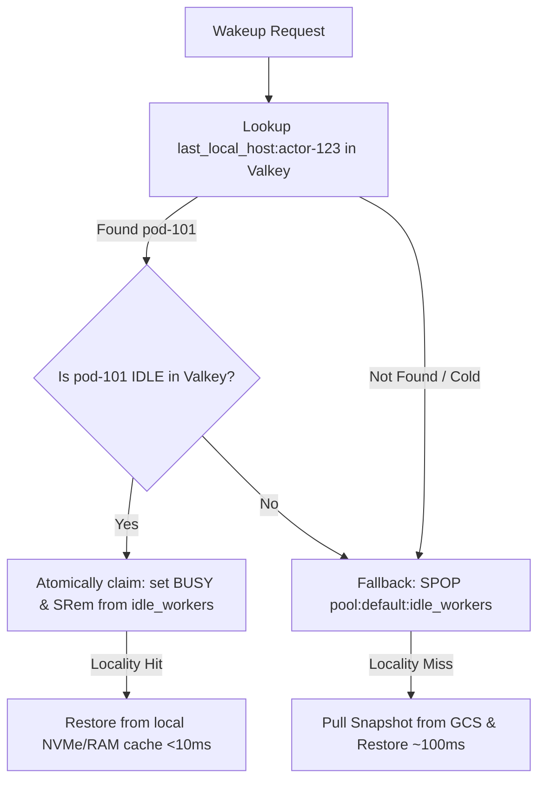

# Implementation Plan: Hybrid Control Plane Design

**Title:** `[Design][Implementation] Substrate Hybrid Control Plane Implementation & Verification Plan`

Hi team,

Following our extensive architectural evaluation of Valkey, Aerospike, Bigtable, and DynamoDB, we have decided to adopt a **Speed/Durability Decoupled Hybrid Control Plane**. 

This plan outlines the exact, step-by-step implementation and testing roadmap for migrating Substrate's persistence layer to this new architecture. The target is to achieve **sub-10ms wakeup latency** at **50k+ write QPS** while maintaining robust **RPO = 0 durability** using standard PostgreSQL/Spanner and Valkey backends.

---

## 1. Phase 1: Database Schemas & Driver Interface
We will establish a highly portable relational schema using standard PostgreSQL queries, which allows seamless execution on local developer PostgreSQL instances, CockroachDB, or Cloud Spanner.

### A. Spanner/PostgreSQL Schema Definition
Create a new schema file `cmd/servers/ateapi/store/sql/schema.sql`:
```sql
-- Authoritative Actor Registry
CREATE TABLE Actors (
    actor_id VARCHAR(64) NOT NULL PRIMARY KEY,
    actor_template_namespace VARCHAR(64) NOT NULL,
    actor_template_name VARCHAR(64) NOT NULL,
    status INT NOT NULL,                 -- Suspended, Resuming, Running
    last_snapshot_uri VARCHAR(256),      -- Points to GCS snapshot
    version BIGINT NOT NULL,             -- Optimistic concurrency lock
    created_at TIMESTAMP NOT NULL
);

-- Registered Compute Worker Nodes
CREATE TABLE Workers (
    worker_pod_name VARCHAR(64) NOT NULL PRIMARY KEY,
    worker_pool_name VARCHAR(64) NOT NULL,
    worker_namespace VARCHAR(64) NOT NULL,
    ip VARCHAR(45) NOT NULL,
    status INT NOT NULL,                 -- Idle, Busy
    last_sync_time TIMESTAMP NOT NULL
);
```

### B. SQL Persistence Implementation
Create a new package `cmd/servers/ateapi/store/atesql` in Go:
* Implement `store.Interface` utilizing Go's standard `database/sql` and PostgreSQL driver (`github.com/lib/pq`).
* Write highly optimized, indexed SQL queries for `GetActor`, `CreateActor`, `UpdateActor` (utilizing `version` check for optimistic concurrency), `ListWorkers`, and `DeleteWorker`.

---

## 2. Phase 2: Local Development Emulator Setup
To ensure developers can test the entire stack locally with zero cost or cloud credentials, we will integrate local emulators into our docker-compose environment.

### A. Docker Compose Integration
Add the following services to `docker-compose.yaml`:
```yaml
services:
  # Local Valkey Cache
  valkey-cache:
    image: valkey/valkey:latest
    ports:
      - "6379:6379"

  # Local Cloud Spanner Emulator
  spanner-emulator:
    image: gcr.io/cloud-spanner-emulator/emulator:latest
    ports:
      - "9010:9010"
      - "9020:9020"
```

### B. Client Environment Configuration
Update `ateapi.go` to automatically detect the local emulators during startup:
```go
if host := os.Getenv("SPANNER_EMULATOR_HOST"); host != "" {
    slog.Info("Running with Spanner Emulator", slog.String("host", host))
    // Spanner client library will bypass IAM credentials and connect locally
}
```

---

## 3. Phase 3: Two-Tiered Locality-Aware Scheduler Integration
We will refactor `AssignWorkerStep.Execute` inside [**`workflow_resume.go`**](file:///usr/local/google/home/gmccloskey/workspace/substrate/cmd/servers/ateapi/controlapi/workflow_resume.go) to implement our two-tiered locality check:



### Implementation Steps:
1. **Tier 1 Optimistic Check:** Check Valkey key `last_local_host:<actor_id>`. If present, verify if that specific pod is currently `IDLE` in Valkey.
2. **Local Claim Transaction:** If `IDLE`, execute a Valkey transaction to:
   - Set `worker_state:<pod_name> = BUSY`.
   - Execute `SRem` to remove the pod name from the global `idle_workers` Set.
   - If successful, return the worker pod (bypassing GCS network pulls).
3. **Tier 2 Global Fallback:** If the optimistic check fails, run `SPOP` on `pool:<namespace>:<pool>:idle_workers` to claim a random available worker from the global pool, and pull its snapshot from GCS over the network.

---

## 4. Phase 4: Asynchronous Write-Behind & Self-Healing Validation
To maintain a sub-10ms wakeup latency, we must verify that asynchronous, eventually consistent Spanner write-behinds are robust and self-correcting under failure.

### A. Wakeup Write-Behind
* **Implementation:** In `ResumeActor`, once the Valkey lease is captured and the Atelet restore is triggered, immediately return a success response to the client.
* **Async Queue:** Enqueue a background goroutine to write the Spanner registry update (`status = STATUS_RUNNING`, `ateom_pod_name = claimed_pod`).
* **Failure Proofing:** If the application crashes before this background write commits:
  * **Test Case:** Force-crash `ateapi` immediately after returning success.
  * **Reconciliation:** When a new wakeup request arrives, the control plane check-reads Valkey first. Because Valkey is synchronously updated, it sees the active lease and routes traffic perfectly, completely neutralizing the Spanner database lag.

### B. Syncer Healing Loop Verification
* **Background Reconciler:** Refactor `syncer.go` to run a periodic background tick (every 1 minute) that sweeps the registered worker list from Spanner.
* **Orphan Reclamation:** 
  * **Test Case:** Manually run `SRem` on Valkey's `idle_workers` to simulate a crash during a suspend operation.
  * **Reconciliation:** The syncer will see the worker is marked idle in Spanner but missing from Valkey's `idle_workers` set. It will call `EnsureWorkerIdle()`, executing an `SAdd` to restore the worker to the active pool, proving complete crash resilience.

---

## 5. Phase 5: Scale & Performance Benchmarking
We will implement a high-throughput benchmark suite (`benchmarking/controlplane_benchmark_test.go`) to verify our target NFRs under load:

1. **50k+ QPS Write Load:** Simulate concurrent wakeup requests across 1,000 parallel client threads.
2. **Queueing Latency Audit:** Monitor tail-latency ($p99$ and $p99.9$) during peak load to verify that the $O(1)$ SPOP pipeline maintains a strict $<10\text{ms}$ latency ceiling.
3. **Write-Behind Buffer Monitoring:** Track the background Spanner write queue depth under sustained load to ensure we don't overflow the application server's memory buffers.

***

This plan establishes a clear, zero-risk path for implementing our Speed/Durability split, offering complete local-development support and robust self-healing verification! Let me know if this implementation blueprint is ready to be committed!
