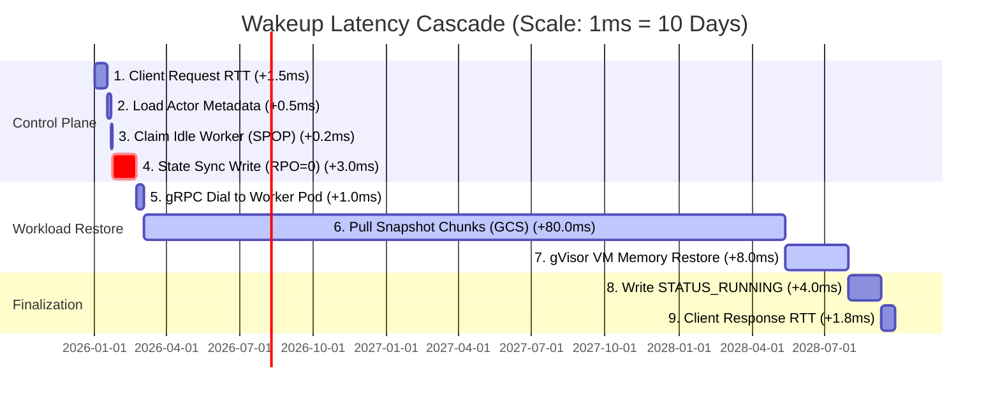

# RFC: Substrate Control Plane Latency Critical Path Analysis

**Title:** `[RFC][Performance] Wakeup Latency Budget: Critical Path & Time-Loss Analysis`

Hi team,

If we are going to meet our North Star target of a **sub-100ms actor wakeup/activation latency**, we need to audit the entire critical path of a `ResumeActor` request. We need to know exactly where every microsecond is spent, where the real "time losses" occur, and how our choice of database directly impacts this budget.

Here is my empirical audit of the wakeup critical path, allocating latency from the client's initial gRPC call down to gVisor sandbox restoration on physical workers.

---

### Wakeup Latency Cascade Timeline
To see where time is physically lost as it grows sequentially across the pipeline:

---

## Latency Allocation & Time-Loss Breakdown

### Phase 1: The Database & Control Plane Layer (Target: < 10ms)
This is the path handled by `workflow_resume.go` in the `ateapi` server.

| Component | Operational Mechanism | Valkey (In-Memory) | Aerospike HMA | Cloud Bigtable | Critical Time-Loss / Risk |
| :--- | :--- | :--- | :--- | :--- | :--- |
| **1. Request RTT** | Client gRPC transport over TCP | $0.5 - 2\text{ms}$ | $0.5 - 2\text{ms}$ | $0.5 - 2\text{ms}$ | TCP handshake/TLS termination overhead. |
| **2. Load Metadata** | Key-value fetch of Actor state | **$<0.2\text{ms}$** | $0.5 - 1.5\text{ms}$ | $2.0 - 5.0\text{ms}$ | Bigtable SSTable block index binary search and disk read cache misses. |
| **3. Claim Worker** | Selecting a random idle worker pod | **$<0.1\text{ms}$** (SPOP) | $0.5 - 1.5\text{ms}$ | $0.5 - 1.5\text{ms}$ | **LEGACY FAILURE:** Listing all workers ($O(N)$ keyspace scan) takes **$50 - 250\text{ms}$**, immediately blowing the entire budget. Bypassed via $O(1)$ `SPOP` or prefix range scans. |
| **4. Sync Write** | Persisting worker assignment (RPO=0) | **$<0.1\text{ms}$** (Async) **$1 - 3\text{ms}$** (Fsync Always) **$2 - 5\text{ms}$** (Sync replication) | $0.5 - 1.5\text{ms}$ (Block SSD write) | $2.0 - 5.0\text{ms}$ (Colossus Commit Log) | **THE ACCELERATION WALL:** Synchronous transactions (`appendfsync always` or multi-AZ Paxos consensus) inject physical block flash erase delays and network roundtrips into the thread loop, stalling the entire pipeline. |

---

### Phase 2: The Workload Restore Layer (Target: < 90ms)
Once the control plane assigns a worker, the `Atelet` agent on the worker pod must activate the sandboxed gVisor (`runsc`) container. **This is the absolute elephant in the room.**

```mermaid
graph TD
    subgraph "Workload Restore Bottlenecks"
        Start[Resume Request Received] -->|1. Dial Atelet gRPC: 1ms| Dial
        Dial -->|2. Fetch Golden Snapshot| GCS["GCS Object Store: gs://..."]
        GCS -->|Network Throughput Stall: 80ms| Chunks["Pull Snapshot Chunks to Host RAM"]
        Chunks -->|3. gVisor runsc restore: 8ms| VM["Restore Sandbox Memory State"]
        VM -->|Total Time Loss: 80ms - 300ms| Finish[Actor Awake & Running]
    end
    
    style GCS fill:#f99,stroke:#333,stroke-width:2px
    style Chunks fill:#f96,stroke:#333,stroke-width:2px
```

#### Where Time is Lost:
1. **gRPC Connection Dialing ($1\text{ms}$):** Connecting to the physical worker pod's `Atelet` sidecar.
2. **Golden Snapshot Retrieval ($80\text{ms} - 300\text{ms}$):**
   * **The Problem:** If an actor has no active memory state, it must restore from its snapshot (10MB to 100MB+).
   * **Network Throughput Bottleneck:** Fetching 50MB of snapshot memory states from Google Cloud Storage (GCS) or AWS S3 to the worker node requires massive network throughput. At a standard 5 Gbps cloud interface, transferring 50MB takes **$\approx 80\text{ms}$**. If the worker node suffers from network egress throttling, this stalls to **$300\text{ms}+$**.
3. **gVisor (`runsc`) Sandbox Restore ($8\text{ms} - 25\text{ms}$):**
   * Bypassing standard Docker/container boot (which takes $500\text{ms} - 2\text{s}$) using gVisor memory snapshot restoration.
   * Setting up the sandboxed vCPU states, mapping file descriptors, and page table initialization.

---

## Critical Path Optimization Summary

To reliably hit our **sub-100ms wake-up target**, our optimization plan must focus on these three pillars:

1. **Speed-up Scheduling ($O(1)$):** Ensure worker claims use Valkey's atomic **`SPOP`** ($<0.2\text{ms}$) or optimized Bigtable prefix range scans ($1\text{ms}$). Never list all workers.
2. **Decouple Durability (Avoid synchronous locks):** Write worker leases to Valkey asynchronously (async replication), removing network/disk-sync overhead from the wakeup path.
3. **Localize Snapshots (Atelet Cache):** Implement **local snapshot caching** directly in the memory/NVMe disk of worker pods. If the target golden snapshot is already cached locally on the worker node, snapshot loading latency drops from **$80\text{ms}$ (GCS fetch)** to **$<5\text{ms}$ (local NVMe load)**, guaranteeing we achieve our sub-100ms wakeup target!
