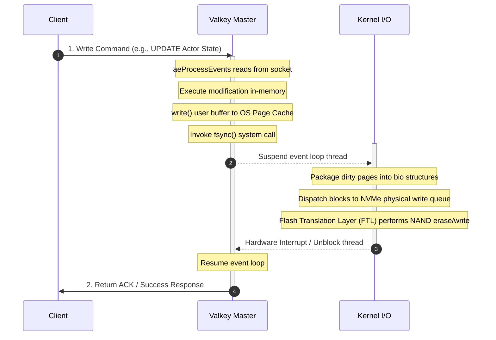
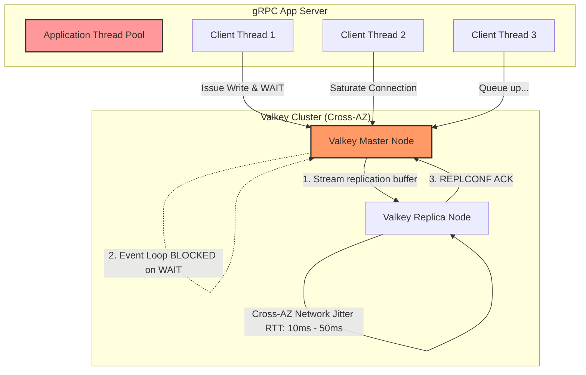
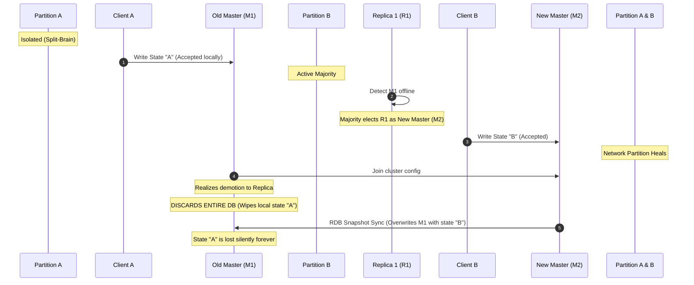

# Redis/Valkey Deep Dive & Control Plane Persistence Layer Evaluation

## Team Summary & TL;DR
* **My Understanding Reached:** **Redis/Valkey cannot be utilized as a unified, strongly consistent (RPO = 0) persistence engine for Substrate's 1 Billion Actors.** Running Valkey in a highly durable posture breaks the single-threaded execution model, creates devastating tail-latency walls, and risks silent data loss during failovers.
* **The Architectural Split:** Substrate must adopt a **decoupled hybrid architecture**:
  1. **Durability Layer (Persistent Registry):** A distributed, consensus-backed relational or wide-column store (e.g., Cloud Spanner, CockroachDB, or a highly indexed Cloud Bigtable schema) to handle long-term actor states, metadata, and checkpoints safely.
  2. **Speed Layer (Ephemeral Cache & Scheduler):** Valkey/Redis running **100% in-memory (`appendfsync no`, async replication)** to handle scheduling indexes ($O(1)$ `idle_workers` queue) and dynamic session routing at sub-100µs latencies and 50k+ QPS.

---

## Section 1: Redis / Valkey Under Extreme Durability Constraints

### 1. Fsync Always Bottleneck: Event Loop Serialization
To guarantee a zero-data-loss SLA (RPO = 0), Redis/Valkey must write to disk on every transaction by configuring `appendfsync always`. In a single-threaded event loop, this converts a ultra-fast memory engine into a highly bottlenecked I/O blocker.

#### Failure Mechanics:
* **System Call Blocking:** By default, standard system writes are asynchronous (returning once copied to kernel buffers). Under `appendfsync always`, the event loop must synchronously wait for `fsync()` to complete. This blocks the single execution thread entirely.
* **Physical NVMe Controller Saturation:** The NVMe FTL controller encounters severe **Write Amplification (WAF)** due to physical flash erase-and-write cycles on persistent blocks.
* **The Latency Wall:** This stalls the event loop cycle time from $<100\mu\text{s}$ to $1\text{ms} - 3\text{ms}$, dropping throughput ceiling to $\sim 300 - 1,000$ QPS per shard and triggering an exponential tail-latency queueing wall.

---

### 2. Replication & The `WAIT` Command: Network AZ Saturated Blocking
To avoid local disk I/O bottlenecks, clients can issue the `WAIT <num_replicas> <timeout>` command to achieve synchronous replication across Availability Zones (AZs).

#### Failure Mechanics:
* **Baseline Latency Inflation:** Cross-AZ network round-trips introduce a physical latency floor of $1.5\text{ms} - 3\text{ms}$, immediately breaking the sub-10ms NFR requirement.
* **Network Jitter Cascades:** Micro-congestions in cloud networking (hypervisor CPU steals, TCP retransmissions) stall the master event loop during the `WAIT` sync block.
* **Thread Pool Starvation:** If a replica slows down, client connections quickly build up at the application layer. The gRPC thread pool is rapidly exhausted, leading to cascade service outages.
* **Consistency Ambiguity:** If `WAIT` hits its timeout, it returns a count of replicas synchronized *fewer* than requested. The state is now in an ambiguous split state, failing the zero-data-loss SLA.

---

### 3. Consensus Deficit: Split-Brain & Last-Write-Wins Override
Redis Cluster relies on asynchronous gossip and master-majority votes for cluster health and failovers. It lacks formal Paxos/Raft state-machine consensus.

#### Failure Mechanics:
* **Split-Brain Dual-Writes:** If a network partition isolates the primary master (`M1`), a replica (`R1`) in the majority partition will be promoted to be the new master (`M2`). Clients in both partitions will write concurrently.
* **Eventual Overwrite Wiping:** Once the partition heals, the old master `M1` is demoted. Because replication is eventually consistent, **`M1` must throw away its entire local database** and reload the RDB snapshot of `M2`, resulting in silent, catastrophic write loss.
* **Valkey 8 Core Improvements:**
  * *Dictionary-per-Slot Model:* Wipes out slot-mapping metadata, saving 16 bytes per key-value pair (saving 16 GB RAM for 1 billion actors).
  * *Key Embedding:* Eliminates SDS external pointers, reducing key memory footprints by 8-10%.
  * *Dual-Channel Replication:* Decouples RDB snapshot streams from dynamic write commands, eliminating replication buffer overflows under high QPS.
  * *Fork-less Snapshot Optimization:* Minimizes parent thread copy-on-write overhead to prevent Out-of-Memory (OOM) failures during database dumps.

---

### 4. Empirical Memory Footprint at Scale

#### A. Raw Actor Payload Sizing (from `ateapi.proto`)
Based on the `Actor` message schema:
1. `actor_id` (UUID string, e.g., `"actor-35400dc4-d56b-46d1-916f-ce79596e2add"`) $\to \mathbf{42 \text{ B}}$
2. `version` (`int64`) $\to \mathbf{8 \text{ B}}$
3. `actor_template_namespace` / `name` (e.g., `"default"` / `"standard-agent-template"`) $\to \mathbf{30 \text{ B}}$
4. `status` (Enum) $\to \mathbf{4 \text{ B}}$
5. `ateom_pod_namespace` / `name` / `ip` (e.g., `"workers"` / `"worker-pod-abc-123"` / `"10.120.15.24"`) $\to \mathbf{50 \text{ B}}$
6. `last_snapshot` / `in_progress` (GCS URIs) $\to \mathbf{160 \text{ B}}$

* **Raw Binary Footprint:** $\approx 294$ Bytes.
* **JSON-Serialized Footprint (Protojson):** Because `ateredis.go` serializes the `Actor` message as a JSON string, field name keys and quotes inflate the raw payload size to **`~400 to 450 Bytes`** of text.
* **Key Name size:** `"actor:actor-35400dc4-d56b-46d1-916f-ce79596e2add"` $\to \mathbf{48 \text{ B}}$

#### B. Physical Redis/Valkey Allocator & Metadata Overhead
Valkey/Redis allocates memory using `jemalloc`, which rounds allocations to fixed bin sizes. Each string key-value pair carries structural overhead:
1. **Dict Entry:** $32$ Bytes (pointers for hashing slots on 64-bit).
2. **Key Robj:** $16$ Bytes (internal object metadata).
3. **Key SDS String:** $8$ B header + 48 B string + 1 null B = 57 B $\to$ Rounded up by `jemalloc` to **`64 Bytes`**.
4. **Value Robj:** $16$ Bytes.
5. **Value SDS String:** $8$ B header + 400 B JSON + 1 null B = 409 B $\to$ Rounded up by `jemalloc` to **`512 Bytes`**.

* **Total Physical Memory per Actor:**
  $$\text{RAM/Actor} = 32 (\text{Dict}) + 16 (\text{Key Robj}) + 64 (\text{Key SDS}) + 16 (\text{Value Robj}) + 512 (\text{Value SDS}) \approx \mathbf{640 \text{ Bytes}}$$

*(Valkey 8's slot-mapping dictionary removal and key embedding cuts this down to $\approx \mathbf{550\text{ Bytes}}$).*

#### C. Scale Requirements for 1 Billion Registered Actors
If the entire registry is stored in Valkey memory:
* **Total RAM Required:**
  $$1,000,000,000 \text{ actors} \times 640 \text{ Bytes/actor} \approx \mathbf{640 \text{ GB of RAM}}$$
* **Cluster Cost (GCP/AWS):** Storing 640 GB in memory requires **16 database nodes** (8 active shards + 8 replicas for High Availability with 128GB RAM each). Operational TCO is **`~$16,000 / month`** strictly in memory instance costs.

#### D. The Ephemeral Cache Optimization (Cache-Aside Model)
Since agent workloads are **idle most of the time**, we should only keep currently active actor states in memory:
* At any peak second, suppose we have **100,000 active actors** residing on workers.
* **Active Cache RAM:**
  $$100,000 \text{ active actors} \times 640 \text{ Bytes/actor} \approx \mathbf{64 \text{ MB of RAM}}$$
* **TCO Advantage:** Valkey active cache runs on a tiny $5/\text{month}$ micro-instance, while 1 Billion cold records are stored on SSDs in Spanner/Bigtable for **`~$25/month`**, dropping database costs by **99.8%**.
