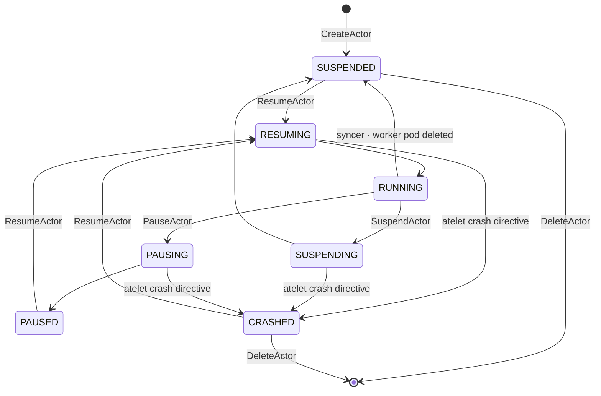

# Lifecycle

This page describes how state moves through the storage tier — the
actor state machine, the four lifecycle workflows that drive it, the
worker side (creation, assignment, release, deletion), and the worker
cache that makes scheduling fast.

## Actor state machine

The two "at rest" states differ in durability and resume cost:

- **SUSPENDED** — snapshot lives in durable object storage. Survives
  node loss. Slower resume (network pull of the snapshot).
- **PAUSED** — snapshot lives on the node where the actor was
  running. Faster resume from local cache, but lost if that node
  fails. The actor record carries
  `latest_snapshot_info.local.node_vms_with_local_snapshots` so the
  scheduler can route the next resume to that node. Note: this list
  is written once, at pause time — nothing updates it if the node
  later dies or evicts the checkpoint, so it can go stale silently
  (tracked in the [`operations.md`](./operations.md) risks table).

There is also a failure state:

- **CRASHED** — the atelet reported an unrecoverable workload failure
  (a crash directive returned from `Checkpoint`, `Restore`, or `Run`),
  or a suspend/pause workflow found the actor mid-transition with no
  pod coordinates left. `crashActor` / `maybeCrashActor`
  (`cmd/ateapi/internal/controlapi/crash.go`) park the actor here and
  surface `DataLoss` to the caller. CRASHED is not a dead end:
  `ResumeActor` accepts it (the resume path has no status gate) and
  `DeleteActor` accepts it alongside SUSPENDED. The syncer's
  dead-worker release path deliberately **preserves** CRASHED rather
  than resetting it to SUSPENDED.

The transitional states (`RESUMING`, `SUSPENDING`, `PAUSING`) only
exist for the duration of the corresponding workflow. An actor stuck
in a transitional state past the lock TTL (30 s) is stranded — see
[`operations.md`](./operations.md).

## Worker side

### Source of truth: the syncer

Worker records in Valkey are not created or deleted by application
calls — they're driven entirely by the Kubernetes pod lifecycle of
worker pods. The `WorkerPoolSyncer` (`cmd/ateapi/internal/controlapi/syncer.go`)
watches worker pods via a K8s informer and reflects pod events into
the store:

- Pod **Added** (eligible) → `CreateWorker`, with the pool's labels
  and sandbox class copied onto the worker record
- Pod **Updated** → `UpdateWorker` when the pod IP, the pool's
  sandbox class, or the pool's labels changed. Note the fan-out:
  editing a pool's labels re-writes (and publishes a pub/sub event
  for) **every worker in that pool**
- Pod **Deleted** (or `DeletionTimestamp` set) →
  `releaseActorOnDeadWorker` (resets the actor bound to the dying
  worker, if any) followed by `DeleteWorker`

The syncer is the only writer for worker create/delete; the lifecycle
workflows below only mutate the **`Assignment`** sub-message (a
reference to the assigned actor and its template) on existing worker
records.

### Worker cache

The `cmd/ateapi/internal/workercache` package keeps an in-process
mirror of all worker records inside every `ate-api-server` pod. The
cache exists so `AssignWorkerStep` does not pay an O(N) `ListWorkers`
scan against Valkey on every actor resume — it reads `Workers()` in
microseconds.

How it stays in sync (list + watch + relist):

1. **Initial sync.** On startup, `Cache.Start` subscribes to
   `WatchWorkers` (Valkey pub/sub), then runs `ListWorkers` once to
   populate the map. `Workers()` returns "not ready" until this
   completes.
2. **Live updates.** Every `CreateWorker` / `UpdateWorker` /
   `DeleteWorker` against the store publishes a `WorkerEvent` on the
   `worker-changes` channel. The cache's subscriber goroutine
   receives events and applies them to the map. Events are compared
   by `version`; a stale event cannot overwrite a fresher cache
   entry.
3. **Periodic relist.** Re-runs `ListWorkers` on a schedule to catch
   anything pub/sub missed (slow consumer, dropped events, transient
   subscription drop).
4. **Disconnect resync.** If the subscriber's channel closes, the
   cache marks itself not-ready and re-runs the initial sync with
   exponential backoff (1 s doubling to a 30 s cap). It retries
   indefinitely until success or shutdown — the backoff's step count
   bounds the *growth* of the delay, not the number of attempts.

The cache is **per API-server pod**. Each pod independently
subscribes to the cluster-wide pub/sub channel, so all pods see the
same events. Pods stay eventually-consistent with each other on the
order of pub/sub latency (sub-second steady state).

`Workers()` returns pointers directly into the cache map. Callers
that need to mutate a worker proto (e.g. setting its `Assignment`
during scheduling) must `proto.Clone` first to avoid corrupting the
cache.

### Eligibility — which workers can run which actor

Not every free worker can run any actor. The scheduler filters
per-worker via **`isWorkerEligibleForActor`** (in
`cmd/ateapi/internal/controlapi/workflow_resume.go`), which checks
three constraints against fields cached on the Worker record itself:

1. **Sandbox class match.** Snapshots are not portable across sandbox
   classes (gvisor, microvm, etc.). The worker's `sandbox_class` must
   equal the template's `Spec.SandboxClass`. Hard gate.
2. **Template's worker-selector.** A K8s `LabelSelector` on
   `ActorTemplate.Spec.WorkerSelector`, matched against the worker's
   `labels`.
3. **Actor's worker-selector.** A `Selector` (match-labels only) on
   the `Actor.WorkerSelector` field, set at CreateActor and
   updatable. Also matched against the worker's `labels`.

The worker's `labels` and `sandbox_class` are copied from its
WorkerPool by the syncer at creation and kept current when the pool
changes — so matching is *evaluated* per worker, but the values are
still pool-derived: two workers of the same pool always match
identically today. The payoff of caching them on the worker record
is that the resume path no longer reads WorkerPool CRDs at all —
scheduling runs entirely against the worker cache. One consequence:
there is no distinct "no worker pool matches" error anymore; an
over-constrained selector surfaces as `no free workers available`.

### Locality restriction (paused actors)

When the actor's latest snapshot is a **local** checkpoint, locality
is a hard constraint, not a preference: the checkpoint physically
exists only on the node(s) listed in
`latest_snapshot_info.local.node_vms_with_local_snapshots`, and
`findFreeWorker` restricts candidates to workers on those nodes.
There is **no fallback** — a local snapshot cannot be restored
elsewhere, and the `SnapshotInfo` oneof means a paused actor holds no
external-snapshot URI to fall back to. If the listed node has no free
eligible worker, the resume fails (`no free workers available`) until
one frees up there. If the node itself is **gone**, the actor is
stuck: `boot=true` does not help — it only skips the template's
*golden* snapshot when the actor has no snapshot of its own; an
existing local checkpoint is always restored — and the syncer's
dead-worker reset does not apply to a finalized PAUSED actor (its pod
coordinates were already cleared at pause time). There is no
API-level escape hatch today; tracked in the
[`operations.md`](./operations.md) risks table. This is a known
modeling limit of the current snapshot schema.

## The four workflows

All four workflows live in `cmd/ateapi/internal/controlapi/` and are
orchestrated via a generic step engine in `workflow.go`. Resume,
Suspend, and Pause all acquire a per-actor distributed lock
(`lock:actor:<id>`, 30 s TTL, 28 s workflow timeout) before running
their step sequence. Note the lock key is **not** atespace-scoped:
same-named actors in different atespaces contend on one lock (safe,
but a cross-tenant fairness quirk).

### CreateActor

Trigger: client API call. No lock; relies on storage-level CAS.

Steps:

1. Validate request, fetch the `ActorTemplate` from the K8s lister,
   and check the target atespace exists (`AtespaceExists`) —
   `FailedPrecondition` if not. Actor identity is
   `(atespace, name)`; the record lands at `actor:<atespace>:<id>`.
2. Construct an `Actor` proto with `version=1`,
   `status=STATUS_SUSPENDED`.
3. `CreateActor` (storage `SET NX`) — returns `ErrAlreadyExists` if
   the `(atespace, id)` pair is taken.
4. `GetActor` to return the stored record.

Failure modes covered in [`operations.md`](./operations.md).

### ResumeActor (SUSPENDED or PAUSED → RUNNING)

Trigger: client API call. Acquires `lock:actor:<id>`.

Steps:

1. **LoadActorForResume** — `GetActor` + `Get ActorTemplate`.
2. **AssignWorker** — read `workerCache.Workers()`, look for an
   existing assignment from a previous failed attempt (idempotency) —
   releasing it back to the free pool first if it is no longer
   eligible (a selector changed since) — otherwise call
   `findFreeWorker` (filtered per-worker by
   `isWorkerEligibleForActor`, and hard-restricted to the
   local-snapshot node set when one exists) and pick a random match.
   Update worker (CAS) with the new `Assignment`, update actor to
   `RESUMING` with pod coordinates.
3. **CallAteletRestore** — a three-way branch against the chosen
   worker's atelet: if the actor has its own snapshot, gRPC `Restore`
   from it (local or external per the `SnapshotInfo` oneof); else if
   the template has a golden snapshot and the request did not set
   `boot=true`, `Restore` from the golden snapshot; else `Run` from
   scratch (resolving sandbox assets from the pool's SandboxConfig).
   `boot` is consulted only in that middle branch — it cannot bypass
   an actor's own snapshot. Atelet errors route through
   `maybeCrashActor`, which parks the actor in `CRASHED` when the
   atelet reports the workload unrecoverable.
4. **FinalizeRunning** — refresh actor record, set status `RUNNING`
   (CAS).

A successful resume ends with actor `RUNNING`, the worker's
`Assignment` pointing at this actor, and a pub/sub event from the
`UpdateWorker` so other API server pods' caches see the change.

`AssignWorker` has exponential backoff (5 attempts) on CAS conflicts.
`FinalizeRunning` does not — a single CAS conflict here strands the
actor in `RESUMING` and requires an external retry.

### SuspendActor (RUNNING → SUSPENDED)

Trigger: client API call. Acquires `lock:actor:<id>`.

Steps:

1. **LoadActorForSuspend**.
2. **MarkSuspending** — update actor to `SUSPENDING`, record an
   `in_progress_snapshot` URI (constructed from the template's
   snapshot location + actor id + a timestamp-random suffix).
3. **CallAteletSuspend** — gRPC `Checkpoint` to the actor's atelet.
   The atelet writes the snapshot to durable storage at the
   `in_progress_snapshot` URI. If the worker pod has vanished
   (`ErrWorkerPodNotFound`), the step skips with a warning — the
   actor record will still be transitioned, but no fresh snapshot
   is written.
4. **FinalizeSuspended** — refresh actor, release the worker
   (`UpdateWorker` clearing its `Assignment`), set actor status
   `SUSPENDED`, promote `in_progress_snapshot` to the
   `latest_snapshot_info.external` field, clear pod coordinates.

Suspend ends with the worker free (pub/sub event broadcast) and the
actor pointing at a fresh durable snapshot. Suspend is the only path
that produces a durably-stored snapshot.

### PauseActor (RUNNING → PAUSED)

Trigger: client API call. Acquires `lock:actor:<id>`.

Steps mirror Suspend but the snapshot is **kept local on the node**
rather than uploaded to durable storage:

1. **LoadActorForPause**.
2. **MarkPausing** — update actor to `PAUSING` and record an
   `in_progress_snapshot` local prefix (actor id + timestamp-random
   suffix).
3. **CallAteletPause** — gRPC `Pause` to the actor's atelet, which
   snapshots in-place on the node under that prefix.
4. **FinalizePaused** — release the worker, set actor status
   `PAUSED`, record the node in
   `latest_snapshot_info.local.node_vms_with_local_snapshots`,
   clear pod coordinates.

Pause is faster than Suspend (no network upload) and produces no
durable artifact. A subsequent ResumeActor **must** land on a worker
whose node is in the local-snapshot set (see "Locality restriction"
above); if that node has no free worker, the resume fails rather
than falling back. And because `FinalizePaused` clears both the
worker's `Assignment` and the actor's pod coordinates, the syncer's
dead-worker release path **ignores** a finalized PAUSED actor — a
later worker-pod deletion does not reset it to SUSPENDED. If the
node itself survives, a new worker there can restore normally; if
the node is **gone**, the actor is stuck: `boot=true` does not
bypass an existing local snapshot, so there is no API-level way to
abandon the checkpoint today (tracked in the
[`operations.md`](./operations.md) risks table). In short: pause
trades durability for speed, and a paused actor is exactly as
durable as the node holding its checkpoint.

### DeleteActor (SUSPENDED or CRASHED → ∅)

Trigger: client API call. No lock; relies on storage-level CAS with
status precondition.

`DeleteActor` does a `WATCH`/`GET`/check
`status ∈ {SUSPENDED, CRASHED}`/`MULTI`/`DEL` against the actor key.
Returns `ErrFailedPrecondition` if the actor is in any other state;
`ErrPersistenceRetry` if another writer changed the key during the
check.

Snapshot URIs in the actor record are **not cleaned up** by
`DeleteActor` — durable snapshots leak in object storage. Tracked
under operations risks.

## Worker lifecycle, end to end

Putting the pieces together for a typical "worker pod gets created,
gets used, gets deleted" cycle:

1. **Pod created** in K8s (manually or by an autoscaler controller).
2. K8s informer in syncer sees the Add event, calls `CreateWorker`
   on the store.
3. `CreateWorker` writes to Valkey AND publishes
   `WorkerEvent{Created, worker}` on `worker-changes`.
4. Every API-server pod's worker cache receives the event and adds
   the worker to its map. Worker is now visible to all schedulers.
5. A `ResumeActor` call lands; `AssignWorker` reads
   `workerCache.Workers()`, picks this worker, `UpdateWorker` is
   called with the new assignment.
6. `UpdateWorker` writes to Valkey AND publishes
   `WorkerEvent{Updated, worker}`. Caches everywhere update.
7. Actor lifecycle continues; eventually `SuspendActor` releases the
   worker via another `UpdateWorker`/`WorkerEvent{Updated}` and the
   worker is idle again.
8. Steps 5–7 may repeat many times — the worker is reused across
   actors.
9. Eventually the pod is deleted (scale-down, node maintenance,
   crash). K8s informer sees the Delete event, syncer calls
   `releaseActorOnDeadWorker` then `DeleteWorker`.
10. `DeleteWorker` removes the key from Valkey AND publishes
    `WorkerEvent{Deleted, worker}`. Caches everywhere remove the
    worker. Worker is no longer visible to any scheduler.

Pub/sub is the load-bearing mechanism keeping all caches in step
with reality. Operational concerns around this — missed events,
broadcast amplification at scale, subscriber backpressure — are in
[`operations.md`](./operations.md).
