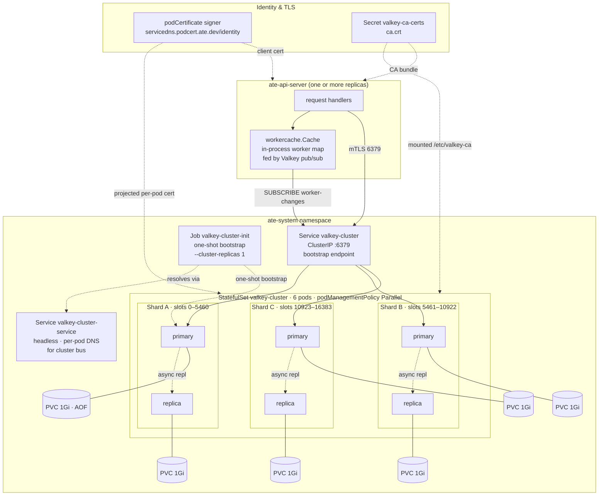

# Topology

This page describes what is deployed for Substrate's storage tier and
how the pieces fit together. The storage tier has two cooperating
components: a Valkey cluster (source of truth) and a per-API-server
in-process worker cache (read-side optimization for the
actor-scheduling critical path).

This page intentionally describes the **deployed** system. Sizing
math, the tiered growth path from pilot to the supported envelope of
10 million actors, durability profiles, and the deployed-vs-target
configuration ladder all live in
[`scaling_to_10m.md`](./scaling_to_10m.md).

## Deployment overview

## Valkey cluster

Source of truth: `manifests/ate-install/valkey.yaml`.

- **StatefulSet** `valkey-cluster`, image `valkey/valkey:9.1` (pinned
  by SHA), 6 pods, `podManagementPolicy: Parallel`. Each pod gets a
  **1 Gi PVC** for AOF + `nodes.conf`.
- **Cluster mode** enabled via the ConfigMap (`cluster-enabled yes`,
  `cluster-node-timeout 5000`, `appendonly yes`). No override of
  `appendfsync` (defaults to `everysec`), no `min-replicas-to-write`,
  no `cluster-require-full-coverage` override (default `yes`), no
  `maxmemory` override. What each of these should become as the
  deployment grows is the configuration ladder in
  [`scaling_to_10m.md`](./scaling_to_10m.md).
- **TLS auto-reload** via `tls-auto-reload-interval 43200` — Valkey
  re-reads its cert and key from the projected volume every 12 hours,
  so routine cert rotation does not require pod restarts. The path
  to a stale cert is still possible if the gap between the volume
  refresh and the next reload is operationally important — see
  `operations.md`.
- **Shape**: bootstrapped with `--cluster-replicas 1` → **3 primaries
  + 3 replicas**, one replica per primary. The 16,384 hash slots are
  split into three roughly equal ranges.
- **Services**: a headless service `valkey-cluster-service` provides
  per-pod DNS for cluster-bus gossip. A ClusterIP service
  `valkey-cluster` is the client bootstrap endpoint; clients populate
  their slot map and then talk to each primary directly.
- **TLS and client auth**: full TLS on the data path with
  `tls-auth-clients yes`. Per-pod server certs come from a
  `podCertificate` projected volume signed by
  `servicedns.podcert.ate.dev/identity` (ECDSA P-256); the CA bundle
  is mounted from the `valkey-ca-certs` secret. On the client side,
  `ate-api-server` authenticates with either an mTLS client cert
  (`--redis-client-cert`) or a Google IAM token
  (`--redis-use-iam-auth`, the flag default) — which one is active
  is deployment configuration, not a fixed property.
- **Bootstrap**: an idempotent `valkey-cluster-init` Job waits for
  all 6 pod DNS names to resolve, then runs `valkey-cli --cluster
  create` if the cluster is not already initialized. Safe to re-run.

### Sharding model

A key's home slot is `CRC16(key) mod 16384`. Application key
families (all in `cmd/ateapi/internal/store/ateredis/ateredis.go`
unless noted):

- **Actors**: `actor:<atespace>:<actor-id>` (`actorDBKey`). The
  atespace is part of the key, which is what makes the scoped
  listing pattern `actor:<atespace>:*` possible.
- **Atespaces**: `atespace:<name>` (`atespaceDBKey`) — one small
  record per atespace; existence is checked at CreateActor.
- **Workers**: `worker:<ns>:<pool>:<pod>` (`workerDBKey`).
- **Locks**: `lock:actor:<id>` (`acquireActorLock` in
  `controlapi/workflow.go`). Note the lock key is **not**
  atespace-scoped — same-named actors in different atespaces share
  one lock.

No hash tags are used, so every key hashes independently and
distribution is roughly uniform across primaries. Multi-key
operations across slots are forbidden — the application either
denormalizes (worker status inlined into actor) or accepts
non-atomicity across keys.

## API server worker cache

Source of truth: `cmd/ateapi/internal/workercache/workercache.go`.

Each `ate-api-server` pod holds an in-process worker cache that
mirrors the workers stored in Valkey. The cache exists so that the
actor-scheduling critical path (`AssignWorkerStep`) does not pay an
O(N) `ListWorkers` scan against Valkey per resume — it reads the
cache in microseconds.

How the cache stays current:

1. On startup, the cache calls `WatchWorkers` to open a Valkey pub/sub
   subscription, then runs `ListWorkers` once to load the initial
   snapshot. This happens **before** the gRPC listener opens — a pod
   that is still syncing is simply not serving yet, and a failed
   startup sync is fatal.
2. On every `CreateWorker` / `UpdateWorker` / `DeleteWorker` against
   the store, ateredis publishes a `WorkerEvent` on the
   `worker-changes` channel.
3. The cache's subscriber goroutine receives events and applies them.
   Created/Updated events are guarded by the worker `version` so a
   stale event cannot overwrite a fresher entry (Deleted events carry
   no version — see `operations.md`, "Missed pub/sub events").
4. A periodic relist (5 minutes) re-runs `ListWorkers` to catch events
   that pub/sub missed (slow subscriber, transient drops, subscriber
   disconnect).
5. On subscription disconnect, the cache marks itself not-ready —
   this is the window where callers see "worker cache not ready" —
   and resyncs with exponential backoff until it succeeds.

The cache is **per API-server pod**. Each pod has its own subscriber
and its own copy of the map. Pub/sub broadcasts cluster-wide, so all
pods see the same events; pods stay eventually-consistent with each
other on the order of pub/sub latency (sub-second steady state).

`Workers()` returns pointers directly from the cache. Callers that
need to mutate a worker (e.g. setting its `Assignment` during
scheduling) must `proto.Clone` first to avoid corrupting the cache.

Worker records carry the scheduling metadata the resume path needs
(`labels` and `sandbox_class`, cached from the owning WorkerPool by
the syncer), so scheduling decisions read only this cache — never
the WorkerPool CRDs. See [`lifecycle.md`](./lifecycle.md) for the
eligibility rules.

## Sizing and scaling

Deliberately not on this page. Capacity math, worker-cache memory
growth, the tier table from pilot deployments to the 10M-actor
envelope, durability profiles, and the full deployed-today vs.
target configuration ladder live in
[`scaling_to_10m.md`](./scaling_to_10m.md).
